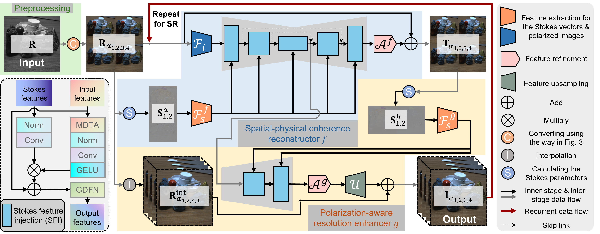

# PIDSR: Complementary Polarized Image Demosaicing and Super-Resolution
By Shuangfan Zhou, Chu Zhou, Youwei Lyu, Heng Guo, Zhanyu Ma, Boxin Shi, Imari Sato



# Requirements
- python=3.8.18
- pytorch=2.0.1
- cv2
- numpy
- tqdm
- scikit-image

# Dataset  
We publicly release our [dataset](), which contains a total of 138 images.

# Pre-trained models
We provide the [pre-trained]() models for inference

# Inference
- You can run inference on the example raw images using the following command:
```bash
python infer.py
```
the results will be saved in the `infer/` directory

- or you can use your own dataset by specifying the `--infer_path` argument:
```bash
python infer.py --infer_path /path/to/your/data
```
# Train  
```bash
python train.py
```

# Citation
If you find this work helpful to your research, please cite:
```
@inproceedings{pidsr2025zhou,  
title = {PIDSR: Complementary Polarized Image Demosaicing and Super-Resolution},  
author = {Shuangfan, Zhou and Chu, Zhou and Youwei, Lyu and Heng, Guo and Zhanyu, Ma and Boxin, Shi and Imari, Sato},  
year = {2025},  
booktitle = CVPR,  
}
```
